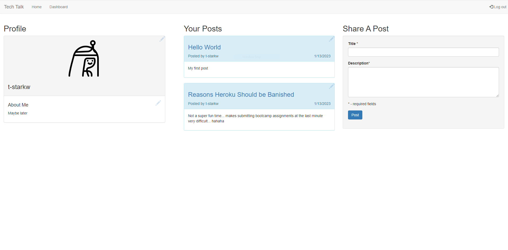
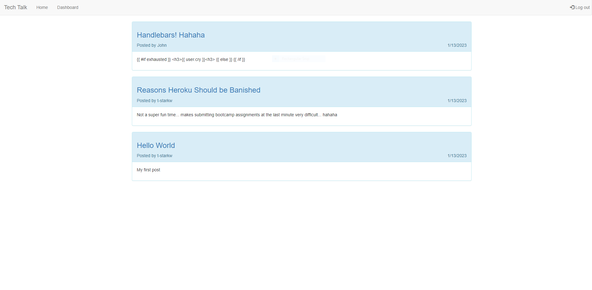

# Tech Talk

## Project Description
This application uses the Model-View-Controller (MVC) paradigm to create a blog-style website where developers can create and personalize an account, edit their information, make posts, edit posts, and comment on other user's posts.

 

## Tools Used to Create This Project
* JavaScript ES6
* Node.js
* Express.js
* dotenv
* MySQL
* Sequelize
* bcrypt
* handlebars
* Heroku

## Usage
The application is deployed on Heroku at 

Visit the website on Heroku. You can view posts and visit links as a visitor, create your own account, and as an authenticated user you can add your own posts and comment on other posts as well. You can edit titles and content or delete your own posts as well. You can also update your username, email, and password.

Warning: New data is stored on Heroku for an indeterminate period of time. At least once a day the dynos will be restarted and any new data included new users might be wiped out.
